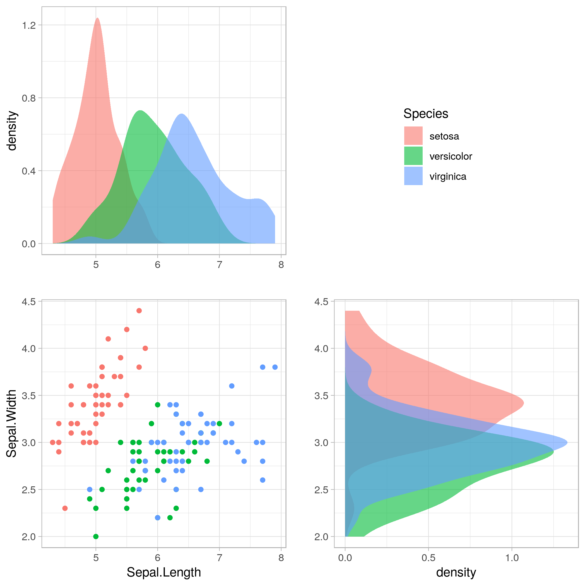

# ggdisplot

Very simple scatterplot with two density plots. I use it often, so here it is.

```r
install_github("scastlara/ggdisplot")
ggdisplot(iris, "Sepal.Length", "Sepal.Width", "Species")
```


